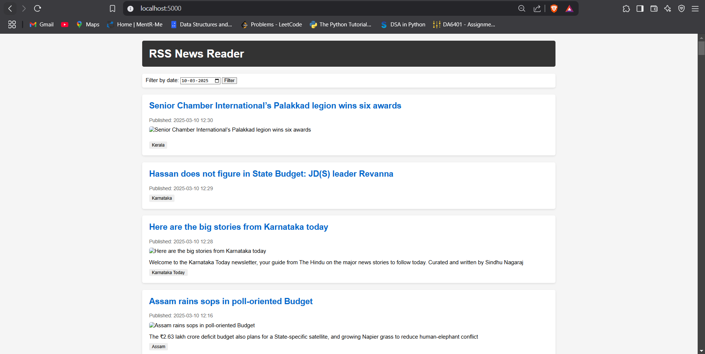

# RSS News Reader Application

## Overview
This application fetches, processes, and displays news articles from RSS feeds. It consists of three containerized services:
- Database container for storing news articles
- RSS Reader container for fetching and processing feeds
- Web Application container for displaying the articles

### Prerequisites
- Docker and Docker Compose

## Running the Application
1. **Clone the repository** \
git clone https://github.com/DA5402-MLOps-JanMay2025/assignment-04-Gamikant.git \
``cd assignment-04-Gamikant``

2. **Start all services** \
``docker-compose up``

3. **Access the web interface** \
Open your browser and navigate to ``http://localhost:5000``

4. To verify sql database entries \
``docker compose ps`` \
``docker exec -it <db-container-name> psql -U rssuser -d rssfeeds -c "SELECT COUNT(*) FROM news_articles;`` \
(OR)  ``docker compose logs rss_reader``

5. **To stop the services** \
``docker-compose stop``

6. **To remove the services** \
``docker-compose down``

## Components
- **Database Container**: PostgreSQL
- **RSS Reader Container**: Python app for fetching feeds
- **Web App Container**: Flask interface

## Features
- Automatic fetching of RSS feeds (currently configured for The Hindu)
- Persistent storage of articles with metadata
- Web interface with date filtering capabilities
- Containerized architecture using Docker Compose

## System Architecture
The application uses a three-tier architecture:
1. **Database Service**: Stores article data including titles, timestamps, links, images, tags, and summaries
2. **RSS Reader Service**: Polls RSS feeds, processes data, and stores in database
3. **Web Application**: Provides user interface to browse and filter articles

## Implementation Details

### Database Service
- Initializes with required database and tables
- Performs validation checks on restart
- Configurable via environment variables

### RSS Reader Service
- Fetches articles from configured RSS feeds
- Processes feed data into structured format
- Downloads and stores article images
- Configurable polling interval (default: 10 minutes)
- Handles various RSS feed structures

### Web Application
- Displays articles with date filtering
- Shows title, image, and summary for each article
- Provides links to original articles
- Clean, responsive design

### Configuration
The application can be configured through environment variables in the `.env` file:
- Database credentials and connection settings
- RSS feed URL and update frequency
- Field mapping for different RSS feed structures
